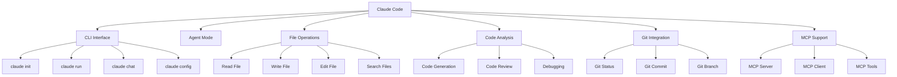

# Claude Code Project Specification

**Version**: 2.0  
**Date**: 2026-04-16  
**Status**: Official Reference Document  
**Source**: Claude Code Book Knowledge Graph

---

## Table of Contents

1. [Executive Summary](#1-executive-summary)
2. [System Architecture](#2-system-architecture)
3. [Core Components](#3-core-components)
4. [CLI Interface Specification](#4-cli-interface-specification)
5. [File Operations API](#5-file-operations-api)
6. [Code Analysis Capabilities](#6-code-analysis-capabilities)
7. [Git Integration Module](#7-git-integration-module)
8. [MCP Protocol Implementation](#8-mcp-protocol-implementation)
9. [Configuration System](#9-configuration-system)
10. [Best Practices Guidelines](#10-best-practices-guidelines)
11. [Security Framework](#11-security-framework)
12. [Session Management](#12-session-management)
13. [Error Handling](#13-error-handling)
14. [Model Support](#14-model-support)
15. [Integration Points](#15-integration-points)
16. [Development Guidelines](#16-development-guidelines)
17. [API Reference](#17-api-reference)
18. [Examples](#18-examples)
19. [Appendices](#19-appendices)

---

## 1. Executive Summary

### 1.1 Product Overview

**Claude Code** is Anthropic's official AI-powered coding agent that operates via CLI. It provides autonomous code generation, analysis, refactoring, and Git operations with human oversight.

### 1.2 Key Metrics

| Metric | Value |
|--------|-------|
| Core Capabilities | 49 nodes |
| Functional Modules | 10 communities |
| CLI Commands | 6 basic + 2 MCP |
| Supported Models | 3 (Opus, Sonnet, Haiku) |
| Integration Points | IDE + Git + MCP |

### 1.3 Target Users

- Software developers
- DevOps engineers
- Technical writers
- Code reviewers
- Project managers

---

## 2. System Architecture

### 2.1 High-Level Architecture

```
┌─────────────────────────────────────────────────────────┐
│                    Claude Code System                    │
├─────────────────────────────────────────────────────────┤
│  ┌───────────────┐  ┌───────────────┐  ┌─────────────┐ │
│  │ CLI Interface │  │ Agent Engine  │  │ Config Mgr  │ │
│  └───────────────┘  └───────────────┘  └─────────────┘ │
├─────────────────────────────────────────────────────────┤
│  ┌───────────────┐  ┌───────────────┐  ┌─────────────┐ │
│  │ File Ops API  │  │ Code Analysis │  │ Git Module  │ │
│  └───────────────┘  └───────────────┘  └─────────────┘ │
├─────────────────────────────────────────────────────────┤
│  ┌───────────────┐  ┌───────────────┐  ┌─────────────┐ │
│  │ MCP Client    │  │ Session Mgr   │  │ Error Hdlr  │ │
│  └───────────────┘  └───────────────┘  └─────────────┘ │
└─────────────────────────────────────────────────────────┘
         ↓                    ↓                    ↓
    ┌─────────┐         ┌─────────┐         ┌─────────┐
    │ Anthropic│         │ MCP Srv │         │ Git Repo│
    │   API    │         │ Network │         │  Local  │
    └─────────┘         └─────────┘         └─────────┘
```

### 2.2 Component Interaction Flow

```
User Input → CLI Parser → Agent Engine → Task Planner
    ↓
Capability Selection (File Ops / Code Analysis / Git / MCP)
    ↓
Execution Engine → Approval Gate (if enabled)
    ↓
Tool Execution → Result Processing → Output Formatter
    ↓
User Output + Session State Update
```

---

## 3. Core Components

### 3.1 Component Registry

| Component | Type | Description | Dependencies |
|-----------|------|-------------|--------------|
| `Claude Code` | tool | Main orchestrator | CLI, Agent Engine |
| `CLI Interface` | interface | User interaction layer | Commands, Config |
| `Agent Mode` | mode | Autonomous execution | Approval Gates, File Ops |
| `File Operations` | capability | File CRUD operations | Read, Write, Edit, Search |
| `Code Analysis` | capability | Code processing | Generation, Review, Debug |
| `Git Integration` | feature | Git operations | Status, Commit, Branch, Diff |
| `MCP Support` | protocol | External tool protocol | Server, Client, Tools |
| `Context Management` | feature | Token budget control | Session, Memory |
| `IDE Integration` | feature | Editor integration | VS Code, JetBrains |

### 3.2 Dependency Graph



---

## 4. CLI Interface Specification

### 4.1 Command Catalog

#### 4.1.1 `claude init`

**Purpose**: Initialize Claude Code in a project directory

**Syntax**:
```bash
claude init [OPTIONS]
```

**Options**:
| Option | Type | Default | Description |
|--------|------|---------|-------------|
| `--project` | string | current dir | Project path |
| `--model` | string | sonnet | Default model |
| `--permissions` | string | interactive | Permission mode |
| `--mcp` | boolean | false | Enable MCP discovery |

**Output**:
```
✓ Claude Code initialized in /path/to/project
✓ Configuration saved to .claude/config.json
✓ MCP servers discovered: 3
```

---

#### 4.1.2 `claude run`

**Purpose**: Execute a task autonomously

**Syntax**:
```bash
claude run <TASK> [OPTIONS]
```

**Parameters**:
| Parameter | Type | Required | Description |
|-----------|------|----------|-------------|
| `TASK` | string | yes | Task description |
| `--model` | string | no | Override model |
| `--timeout` | int | no | Max execution time (seconds) |
| `--approval` | boolean | no | Enable approval gates |

**Example**:
```bash
claude run "Implement user authentication with JWT" --model opus --approval
```

---

#### 4.1.3 `claude chat`

**Purpose**: Start interactive chat session

**Syntax**:
```bash
claude chat [OPTIONS]
```

**Options**:
| Option | Type | Default | Description |
|--------|------|---------|-------------|
| `--session` | string | new | Session ID to resume |
| `--context` | string | project | Context scope |
| `--history` | int | 100 | History lines to load |

**Chat Commands** (inside session):
- `/help` - Show available commands
- `/model` - Switch model
- `/clear` - Clear context
- `/save` - Save session
- `/quit` - Exit chat

---

#### 4.1.4 `claude config`

**Purpose**: Manage configuration

**Syntax**:
```bash
claude config <ACTION> [KEY] [VALUE]
```

**Actions**:
- `get <KEY>` - Retrieve config value
- `set <KEY> <VALUE>` - Set config value
- `list` - Show all config
- `reset` - Reset to defaults

**Config Keys**:
| Key | Type | Description |
|-----|------|-------------|
| `model` | string | Default model |
| `api_key` | string | Anthropic API key |
| `permission_mode` | string | interactive/auto/yolo |
| `context_budget` | int | Token limit |
| `output_format` | string | text/json/markdown |

---

#### 4.1.5 `claude tools`

**Purpose**: List available tools

**Syntax**:
```bash
claude tools [CATEGORY]
```

**Categories**:
- `file` - File operations
- `code` - Code analysis tools
- `git` - Git operations
- `mcp` - MCP tools
- `all` - All tools

---

#### 4.1.6 `claude models`

**Purpose**: List available models

**Syntax**:
```bash
claude models [OPTIONS]
```

**Output**:
```
Available Models:
  • claude-opus-4    (200K context, best quality)
  • claude-sonnet-4  (200K context, balanced)
  • claude-haiku-4   (200K context, fast)
```

---

## 5. File Operations API

### 5.1 API Specification

#### 5.1.1 Read File

**Endpoint**: `file://read`

**Parameters**:
```json
{
  "path": "/path/to/file",
  "encoding": "utf-8",
  "limit": null,
  "offset": 0
}
```

**Response**:
```json
{
  "content": "file contents...",
  "metadata": {
    "size": 1024,
    "lines": 50,
    "language": "python"
  }
}
```

---

#### 5.1.2 Write File

**Endpoint**: `file://write`

**Parameters**:
```json
{
  "path": "/path/to/file",
  "content": "content to write",
  "mode": "overwrite",
  "backup": true
}
```

**Modes**:
- `overwrite` - Replace existing content
- `append` - Add to end
- `insert` - Insert at position

---

#### 5.1.3 Edit File

**Endpoint**: `file://edit`

**Parameters**:
```json
{
  "path": "/path/to/file",
  "edits": [
    {
      "type": "replace",
      "old": "old text",
      "new": "new text"
    },
    {
      "type": "insert",
      "position": 10,
      "content": "new line"
    }
  ]
}
```

---

#### 5.1.4 Search Files

**Endpoint**: `file://search`

**Parameters**:
```json
{
  "pattern": "*.py",
  "directory": "/project",
  "recursive": true,
  "content_match": "import"
}
```

---

#### 5.1.5 Create File

**Endpoint**: `file://create`

**Parameters**:
```json
{
  "path": "/path/to/new/file.py",
  "template": "python-module",
  "content": "initial content"
}
```

---

#### 5.1.6 Delete File

**Endpoint**: `file://delete`

**Parameters**:
```json
{
  "path": "/path/to/file",
  "backup": true,
  "force": false
}
```

---

## 6. Code Analysis Capabilities

### 6.1 Capability Matrix

| Capability | Input | Output | Use Case |
|------------|-------|---------|----------|
| Code Generation | Spec/Prompt | Source Code | New feature implementation |
| Code Review | Source Code | Review Report | Quality assessment |
| Refactoring | Source Code | Refactored Code | Code improvement |
| Debugging | Error Report | Fix Suggestions | Bug resolution |
| Testing | Source Code | Test Cases | Test generation |
| Documentation | Source Code | Doc Strings | API documentation |

### 6.2 Detailed Specs

#### 6.2.1 Code Generation

**Input Schema**:
```json
{
  "language": "python",
  "task": "implement REST API endpoint",
  "constraints": {
    "framework": "fastapi",
    "patterns": ["async", "dependency-injection"],
    "style": "google"
  }
}
```

**Output Schema**:
```json
{
  "files": [
    {
      "path": "api/endpoints.py",
      "content": "...",
      "language": "python"
    }
  ],
  "dependencies": ["fastapi", "pydantic"],
  "tests": "api/test_endpoints.py"
}
```

---

#### 6.2.2 Code Review

**Process**:
1. Analyze code structure
2. Check style compliance
3. Detect potential bugs
4. Suggest improvements
5. Rate code quality

**Output Format**:
```markdown
## Code Review Report

### Overall Score: 85/100

### Issues Found:
1. **Security** (HIGH): SQL injection vulnerability in line 45
2. **Performance** (MEDIUM): Inefficient loop in function `process_data`
3. **Style** (LOW): Missing docstring for class `UserManager`

### Suggestions:
- Add parameterized queries for database operations
- Use list comprehension instead of nested loops
- Add class-level documentation
```

---

#### 6.2.3 Debugging

**Workflow**:
```
Error Input → Error Analysis → Root Cause Detection → Fix Generation → Verification
```

**Capabilities**:
- Stack trace parsing
- Error pattern matching
- Root cause inference
- Fix suggestion generation
- Fix verification

---

## 7. Git Integration Module

### 7.1 Supported Operations

#### 7.1.1 Git Status

**Command**: `git://status`

**Output**:
```json
{
  "branch": "main",
  "changed_files": [
    {"path": "src/main.py", "status": "modified"},
    {"path": "tests/test.py", "status": "added"}
  ],
  "staged": [],
  "untracked": ["temp/"]
}
```

---

#### 7.1.2 Git Commit

**Command**: `git://commit`

**Parameters**:
```json
{
  "message": "feat: add user authentication",
  "files": ["src/auth.py"],
  "amend": false,
  "sign": true
}
```

---

#### 7.1.3 Git Branch

**Command**: `git://branch`

**Actions**:
- `list` - List all branches
- `create <name>` - Create new branch
- `switch <name>` - Switch branch
- `delete <name>` - Delete branch
- `merge <name>` - Merge branch

---

#### 7.1.4 Git Diff

**Command**: `git://diff`

**Parameters**:
```json
{
  "from": "HEAD~1",
  "to": "HEAD",
  "format": "unified",
  "context_lines": 3
}
```

---

#### 7.1.5 Git Merge

**Command**: `git://merge`

**Parameters**:
```json
{
  "branch": "feature/auth",
  "strategy": "recursive",
  "conflict_resolution": "manual"
}
```

---

## 8. MCP Protocol Implementation

### 8.1 Protocol Specification

**Version**: MCP 1.0  
**Transport**: JSON-RPC 2.0 over stdio/SSE/WebSocket

### 8.2 Message Format

**Request**:
```json
{
  "jsonrpc": "2.0",
  "method": "tools/list",
  "id": 1,
  "params": {}
}
```

**Response**:
```json
{
  "jsonrpc": "2.0",
  "result": {
    "tools": [
      {
        "name": "read_file",
        "description": "Read file contents",
        "inputSchema": {...}
      }
    ]
  },
  "id": 1
}
```

---

### 8.3 Core Methods

| Method | Purpose | Parameters |
|--------|---------|------------|
| `initialize` | Initialize connection | clientInfo, capabilities |
| `tools/list` | Discover tools | category filter |
| `tools/call` | Execute tool | tool name, arguments |
| `resources/list` | List resources | type filter |
| `prompts/list` | List prompts | category filter |

---

### 8.4 MCP Server Types

| Server Type | Tools Provided | Use Case |
|-------------|----------------|----------|
| File System | read, write, search, delete | File operations |
| Database | query, insert, update, delete | Data persistence |
| API Connector | get, post, put, delete | External APIs |
| Code Tools | lint, format, test, compile | Code processing |
| Custom | User-defined | Project-specific |

---

### 8.5 Client Implementation

**Connection Flow**:
```
1. Start MCP Server process
2. Send initialize request
3. Receive capabilities
4. Discover tools (tools/list)
5. Call tools as needed
6. Handle responses
7. Shutdown gracefully
```

---

## 9. Configuration System

### 9.1 Configuration File

**Location**: `.claude/config.json`

**Schema**:
```json
{
  "version": "2.0",
  "model": {
    "default": "claude-sonnet-4",
    "fallback": "claude-haiku-4"
  },
  "api": {
    "key": "${ANTHROPIC_API_KEY}",
    "base_url": "https://api.anthropic.com",
    "timeout": 30
  },
  "permissions": {
    "mode": "interactive",
    "auto_approve": ["read_file", "search_files"],
    "require_approval": ["write_file", "git_commit"]
  },
  "context": {
    "budget": 100000,
    "priority": ["system", "user", "file"],
    "prune_strategy": "fifo"
  },
  "output": {
    "format": "markdown",
    "colorize": true,
    "verbose": false
  },
  "mcp": {
    "servers": [
      {
        "name": "filesystem",
        "command": "mcp-server-filesystem",
        "args": ["--root", "/project"]
      }
    ],
    "auto_discover": true
  },
  "git": {
    "auto_commit": false,
    "commit_style": "conventional",
    "sign_commits": true
  },
  "session": {
    "persist": true,
    "max_history": 1000,
    "save_on_exit": true
  }
}
```

---

### 9.2 Permission Modes

| Mode | Description | Approved Actions |
|------|-------------|------------------|
| `interactive` | Manual approval | None (all require approval) |
| `auto` | Automatic with limits | Read, Search, Status |
| `yolo` | Full autonomy | All (use with caution) |

---

### 9.3 Environment Variables

| Variable | Purpose | Default |
|----------|---------|---------|
| `ANTHROPIC_API_KEY` | API authentication | Required |
| `CLAUDE_MODEL` | Default model | claude-sonnet-4 |
| `CLAUDE_CONFIG_DIR` | Config directory | ~/.claude |
| `CLAUDE_LOG_LEVEL` | Logging level | info |
| `CLAUDE_MCP_PATH` | MCP servers path | ~/.claude/mcp |

---

## 10. Best Practices Guidelines

### 10.1 Prompt Design

**Principles**:
1. **Be Specific**: Clear, detailed task descriptions
2. **Provide Context**: Include relevant file paths and requirements
3. **Break Down**: Split complex tasks into smaller steps
4. **Use Examples**: Show expected output format
5. **Iterate**: Refine prompts based on results

**Example Good Prompt**:
```
Implement a FastAPI endpoint for user registration:
- Path: /api/auth/register
- Method: POST
- Input: email, password, name
- Output: user_id, token
- Requirements: password hashing, email validation, duplicate check
- Tests: unit tests for all scenarios
```

---

### 10.2 Context Budget Management

**Strategy**:
```
Total Budget: 100K tokens

Allocation:
  - System Prompt: 10K (fixed)
  - Project Context: 20K (files, structure)
  - Conversation: 50K (history)
  - Working Memory: 20K (current task)
```

**Pruning Rules**:
- Remove old messages first
- Keep recent context
- Preserve critical decisions
- Archive completed tasks

---

### 10.3 Approval Gates

**When to Use**:
- File modifications (write, edit, delete)
- Git operations (commit, push, merge)
- External API calls
- Large-scale refactoring

**Gate Configuration**:
```json
{
  "gates": {
    "file_write": {
      "enabled": true,
      "preview": true,
      "timeout": 30
    },
    "git_commit": {
      "enabled": true,
      "show_diff": true,
      "timeout": 60
    }
  }
}
```

---

### 10.4 Session Management

**Best Practices**:
- Use named sessions for different projects
- Save session before major changes
- Clear context periodically
- Resume sessions for related tasks

---

### 10.5 Error Handling

**Strategy**:
1. Retry transient errors (network)
2. Log all errors with context
3. Graceful degradation
4. User notification with suggestions
5. Recovery recommendations

---

## 11. Security Framework

### 11.1 Security Layers

```
┌─────────────────────────────────┐
│     User Authentication         │
│     (API Key Validation)        │
├─────────────────────────────────┤
│     Permission Gates            │
│     (Action Approval)           │
├─────────────────────────────────┤
│     Execution Sandbox           │
│     (Isolated Environment)      │
├─────────────────────────────────┤
│     Output Filtering            │
│     (Sensitive Data Removal)    │
└─────────────────────────────────┘
```

---

### 11.2 API Key Security

**Requirements**:
- Store in environment variable
- Never commit to repository
- Rotate periodically
- Use separate keys for dev/prod

---

### 11.3 File Access Security

**Rules**:
- Only access project directory
- No system file access
- Validate paths before operations
- Backup before destructive operations

---

### 11.4 Git Security

**Requirements**:
- Sign commits
- Validate commit messages
- No force pushes without approval
- Protect sensitive branches

---

## 12. Session Management

### 12.1 Session Structure

```json
{
  "id": "session-abc123",
  "created": "2026-04-16T10:00:00Z",
  "project": "/path/to/project",
  "model": "claude-sonnet-4",
  "history": [
    {"role": "user", "content": "..."},
    {"role": "assistant", "content": "..."}
  ],
  "context": {
    "files": ["main.py", "utils.py"],
    "git_state": {...},
    "mcp_tools": [...]
  },
  "state": "active"
}
```

---

### 12.2 Session Operations

| Operation | Command | Description |
|-----------|---------|-------------|
| Create | `claude chat` | Start new session |
| Resume | `claude chat --session <id>` | Resume existing |
| Save | `/save` | Save current session |
| List | `claude sessions list` | List all sessions |
| Delete | `claude sessions delete <id>` | Remove session |

---

### 12.3 Context Management

**Context Sources**:
1. Project files (codebase)
2. Git history (recent commits)
3. Session history (conversation)
4. MCP tools (external context)
5. User preferences (settings)

---

## 13. Error Handling

### 13.1 Error Categories

| Category | Examples | Handling |
|----------|----------|----------|
| Network | Connection timeout | Retry 3x, then notify |
| API | Rate limit, invalid key | Wait, notify, suggest |
| File | Not found, permission | Check, request approval |
| Git | Conflict, detached head | Analyze, suggest resolution |
| MCP | Server down, tool error | Fallback, notify |
| Logic | Unexpected output | Log, ask user |

---

### 13.2 Error Response Format

```json
{
  "error": {
    "code": "FILE_NOT_FOUND",
    "message": "File /path/to/file.py not found",
    "suggestions": [
      "Check file path spelling",
      "Use 'claude tools search' to find similar files"
    ],
    "retry_possible": false
  }
}
```

---

### 13.3 Recovery Strategies

**For Network Errors**:
```
1. Wait 5 seconds
2. Retry request
3. If 3 failures, notify user
4. Suggest checking connection
```

**For File Errors**:
```
1. Validate path
2. Check permissions
3. Request approval for access
4. Fallback to alternative path
```

---

## 14. Model Support

### 14.1 Model Comparison

| Model | Context | Speed | Quality | Use Case |
|-------|---------|-------|---------|----------|
| Opus-4 | 200K | Slow | Best | Complex architecture, critical code |
| Sonnet-4 | 200K | Medium | Good | Daily development, refactoring |
| Haiku-4 | 200K | Fast | Basic | Quick fixes, simple tasks |

---

### 14.2 Model Selection Strategy

```
Task Analysis → Complexity Rating → Model Selection

Complexity Criteria:
  - Lines of code: <100 → Haiku, 100-500 → Sonnet, >500 → Opus
  - Architecture changes: Opus
  - Bug fixes: Haiku
  - Code review: Sonnet
  - Documentation: Haiku
```

---

### 14.3 Model Configuration

```json
{
  "models": {
    "claude-opus-4": {
      "max_tokens": 4096,
      "temperature": 0.7,
      "top_p": 0.9
    },
    "claude-sonnet-4": {
      "max_tokens": 4096,
      "temperature": 0.5,
      "top_p": 0.95
    },
    "claude-haiku-4": {
      "max_tokens": 2048,
      "temperature": 0.3,
      "top_p": 0.99
    }
  }
}
```

---

## 15. Integration Points

### 15.1 IDE Integration

**VS Code**:
- Extension: `anthropic.claude-code`
- Features: inline suggestions, file navigation, quick actions
- Commands: Cmd+Shift+C (open Claude Code)

**JetBrains**:
- Plugin: `Claude Code Integration`
- Features: intention actions, code generation
- Shortcut: Ctrl+Alt+C

**Terminal**:
- Direct CLI usage
- Integration with shell (bash/zsh)
- Autocomplete support

---

### 15.2 External Tool Integration

**Via MCP**:
| Tool Type | Example Servers | Integration |
|-----------|-----------------|-------------|
| Database | postgres-mcp, mongo-mcp | Query execution |
| API | rest-api-mcp | HTTP requests |
| Cloud | aws-mcp, gcp-mcp | Cloud operations |
| Testing | pytest-mcp, jest-mcp | Test execution |
| Linting | eslint-mcp, pylint-mcp | Code quality |

---

## 16. Development Guidelines

### 16.1 Code Style

**Python**:
- Follow PEP 8
- Use type hints
- Document with docstrings
- Prefer async for I/O

**JavaScript**:
- Use ES6+ features
- Prefer TypeScript
- Follow Airbnb style
- Document with JSDoc

---

### 16.2 Project Structure

```
project/
├── .claude/
│   ├── config.json
│   ├── sessions/
│   └── mcp/
├── src/
│   ├── main.py
│   ├── utils/
│   └── tests/
├── docs/
│   └── API.md
├── tests/
│   ├── test_main.py
│   └ test_utils.py
├── .gitignore
├── README.md
└── requirements.txt
```

---

### 16.3 Git Workflow

**Commit Style**: Conventional Commits
```
feat: add user authentication
fix: resolve login timeout issue
docs: update API documentation
refactor: simplify auth logic
test: add auth unit tests
```

---

### 16.4 Testing Requirements

- Unit tests for all functions
- Integration tests for endpoints
- Coverage > 80%
- Run before commits
- Document test cases

---

## 17. API Reference

### 17.1 Internal API

**Endpoint**: `internal://<capability>/<action>`

**Examples**:
- `internal://file/read` - Read file
- `internal://git/status` - Git status
- `internal://mcp/call` - MCP tool call

---

### 17.2 External API (Anthropic)

**Base URL**: `https://api.anthropic.com/v1`

**Endpoints**:
| Endpoint | Method | Purpose |
|----------|--------|---------|
| `/messages` | POST | Chat completion |
| `/models` | GET | List models |

**Headers**:
```
x-api-key: <ANTHROPIC_API_KEY>
anthropic-version: 2023-06-01
content-type: application/json
```

---

## 18. Examples

### 18.1 Basic Usage

```bash
# Initialize project
claude init

# Generate code
claude run "Create a REST API endpoint for user CRUD operations"

# Chat session
claude chat
> Help me fix the bug in auth.py line 45
```

---

### 18.2 Git Integration

```bash
# Check status
claude run "What files have changed?"

# Create commit
claude run "Commit current changes with message 'feat: add auth'"
```

---

### 18.3 MCP Usage

```bash
# List MCP tools
claude tools mcp

# Call MCP tool
claude run "Use database MCP to query all users"
```

---

### 18.4 Code Review

```bash
# Review current file
claude run "Review src/main.py and suggest improvements"

# Generate tests
claude run "Generate unit tests for auth module"
```

---

## 19. Appendices

### 19.A Glossary

| Term | Definition |
|------|------------|
| Agent Mode | Autonomous execution mode |
| Approval Gate | User confirmation checkpoint |
| Context Budget | Token limit for conversation |
| MCP | Model Context Protocol |
| Session | Persistent conversation state |

---

### 19.B Knowledge Graph Data

**Nodes**: 49  
**Edges**: 49  
**Communities**: 10  
**Extraction**: 84% EXTRACTED, 16% INFERRED

**Node Distribution**:
| Type | Count |
|------|-------|
| tool | 7 |
| command | 8 |
| capability | 8 |
| feature | 8 |
| protocol | 5 |
| practice | 5 |
| config | 4 |
| model | 3 |
| mode | 1 |
| interface | 1 |

---

### 19.C References

- Anthropic Documentation: https://docs.anthropic.com
- MCP Specification: https://modelcontextprotocol.io
- Claude Code Book: (source PDF)
- Knowledge Graph: https://github.com/agihub-source/claude-code-book-kg

---

### 19.D Version History

| Version | Date | Changes |
|---------|------|---------|
| 1.0 | 2026-04-16 | Initial spec from knowledge graph |
| 2.0 | 2026-04-16 | Detailed project specification |

---

*End of Specification Document*
